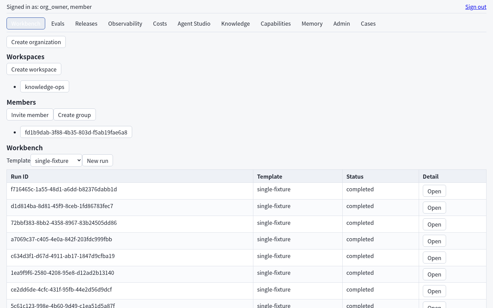
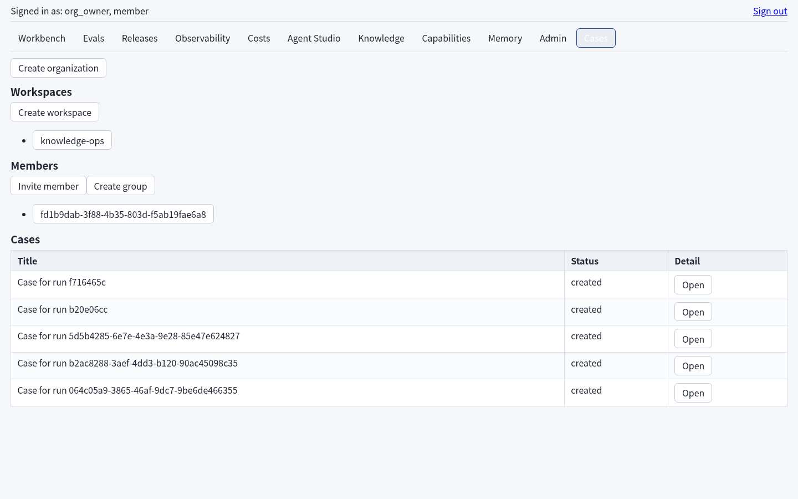
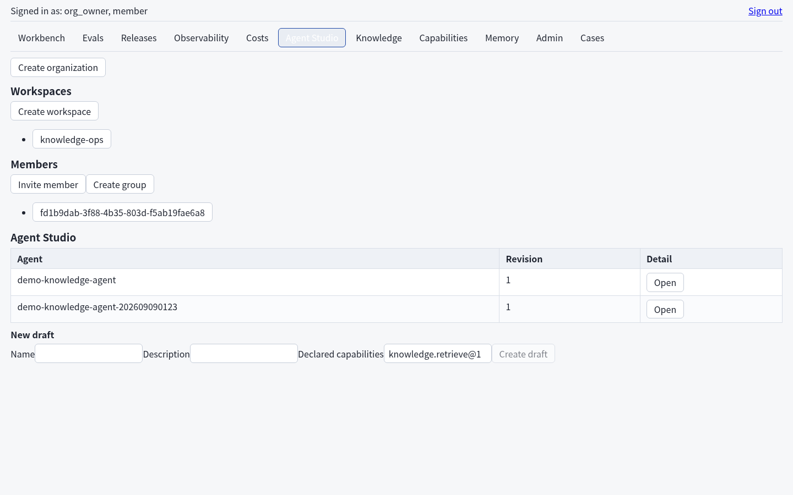
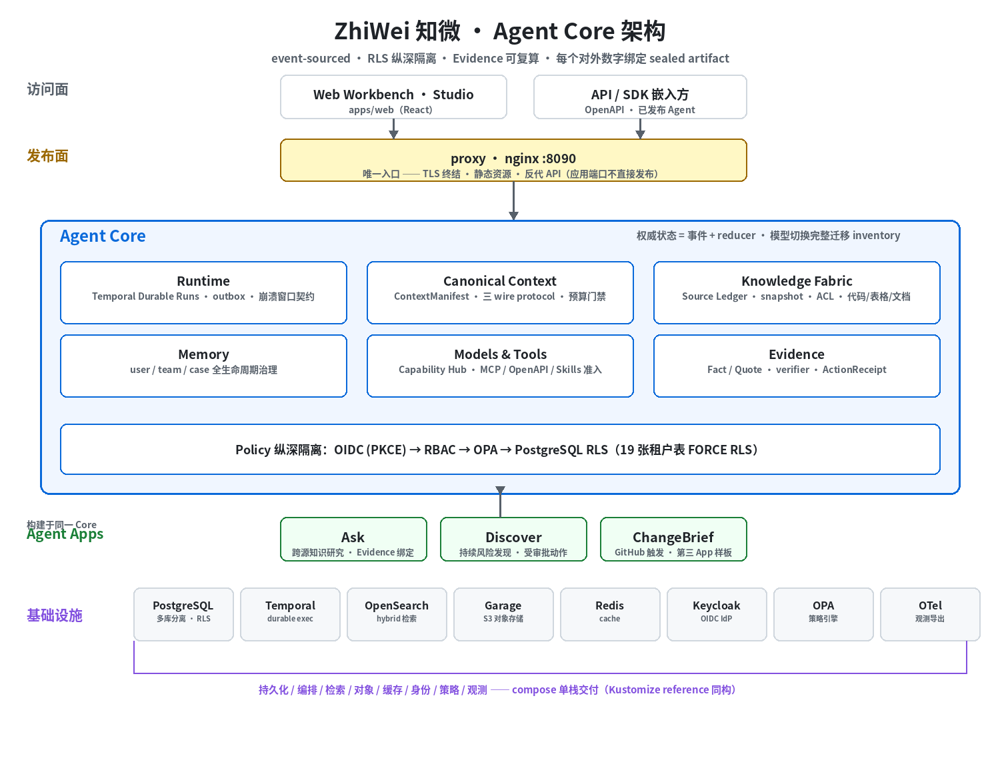

# ZhiWei 知微 — Verifiable Enterprise Agent Core

[](https://github.com/emmmdty/zhiwei/actions/workflows/ci.yml)
[](LICENSE)
[](pyproject.toml)

企业 Agent Core 平台：把内部知识、用户/团队记忆、模型、工具和长期任务编排成**可验证、
可治理**的 Agent Apps（Ask / Discover / ChangeBrief）。

**ZhiWei** is an enterprise Agent Core platform that composes internal knowledge, user/team
memory, models, tools and long-running tasks into *verifiable, governed* Agent Apps —
with tenancy enforced in depth (OIDC+PKCE, RBAC, OPA, PostgreSQL RLS) and every published
number bound to a sealed eval artifact via a Claim Registry.

## 30 秒本地体验

```bash
git clone https://github.com/emmmdty/zhiwei.git && cd zhiwei
uv sync --extra evals --extra dev
make evals && make determinism     # 冻结评测资产重建 + 两次重建逐字节一致（不调用任何模型）
uv run zhiwei dev up               # 全栈：18 个服务（Web/API/PG/Temporal/OpenSearch/Keycloak/OPA…）
# 打开 http://localhost:8090（浏览器 OIDC 旅程需一条 hosts 条目，见 docs/operations/install.md §4）
```

以上命令全部离线确定性执行：**不调用真实 LLM**。live 模型调用需要显式配置 endpoint
connection 并通过策略门禁 + operator 显式触发（见 docs/MODELS.md 附录 A 与 ADR-011）。

## 它解决什么问题

不是「RAG + 工作流编排」的再包装。五个核心立场：

1. **模型不是状态仓库**——权威任务状态由事件和 reducer 管理，按 ContextManifest 编译到
   三种 wire protocol；模型切换时完整迁移 authoritative inventory，装不下就拒绝发送。
2. **知识不是一锅向量库**——文档、表格、代码/GitHub、数据库和 API 保留源原生结构、ACL、
   时态与 snapshot；Context Graph 只导航，Evidence 必须回到 Source Ledger。
3. **工具不是写死的函数**——MCP、OpenAPI、Agent Skills、SDK provider 和 Agent-as-tool
   经过目录发现、准入、Connection/OAuth、版本绑定、策略、审批、隔离执行和撤销。
4. **记忆不是聊天摘要**——user/team/case memory 有来源、敏感度、candidate/confirm/
   conflict/revoke/delete 生命周期；后台 Discover 无权读取个人记忆。
5. **输出可被反驳**——事实 Claim 绑定 snapshot、typed canonical value、文本 span 与
   verifier；动作使用独立 ActionReceipt，不能拿 citation 冒充执行成功。

## 核心能力

| 能力 | 说明 |
| --- | --- |
| **Ask** | 跨文档、业务代码/GitHub、结构化数据与授权系统回答问题；Fact/Quote 绑定可复算 Evidence，明确区分 Inference/Recommendation |
| **Discover** | schedule/webhook/source delta 触发的持续风险发现；Signal → RiskHypothesis（支持/反证）→ 人工处置 → Case → 受审批动作 |
| **Agent Studio** | Builder 选择知识、记忆、模型、Tools、Skills、Task Graph、预算和评测后发布 Agent |
| **Capability Hub** | 从官方 MCP Registry、组织 Git、MCP URL、OpenAPI 或 SDK 导入能力，走检查、准入、连接与版本更新 |
| **Memory** | user/team/case 三层记忆全生命周期治理 |
| **ChangeBrief** | 第三个轻量 App：GitHub 触发 + 代码知识，证明 Agent Core 不依赖 Ask/Discover 专用分支 |

以下截图来自 local-product 全栈的真实认证会话（Keycloak OIDC 登录，基线样式，
fixture/replay 数据面）：

| Workbench（runs 数据面） | Cases（审批治理 Case 面） | Agent Studio |
| --- | --- | --- |
|  |  |  |

## 架构



- **多租户纵深隔离**：OIDC (PKCE) → RBAC → OPA 策略 → PostgreSQL RLS（19 张租户表
  FORCE RLS），dispatcher 专用 bypass 角色只允许 outbox 租户对发现查询。
- **Durable execution**：Temporal 承载 Run 编排；outbox + 崩溃窗口契约测试（#2/#11 必测）。
- **local-product 全栈**：`deploy/compose/` 以 18 个服务交付完整产品（fixture/replay
  替代外部企业系统与 LLM）；Kubernetes reference（Kustomize overlay）与升级/备份/
  故障/负载/安全套件见 `deploy/` 与 `docs/operations/`。

## 基准与声明纪律

<!-- claims:start -->
<!-- 口径：mode=offline · model=reference-fixture · environment=offline-fixture ·
     口径日期 2026-09-08。全部为离线确定性执行，不是 live 模型效果，也不是平台总证据。 -->

| 声明（语料内口径） | 绑定值（sealed artifact） |
| --- | --- |
| 抗污染事实问答语料内回归（corpus-internal，非平台总证据） | factqa-v1 语料内 accuracy 1.000（120/120 samples，evidence replay 路径） |
| 知识文档检索判分（corpus-internal） | knowledge-doc-v1 retrieval 判分通过率 1.000（15/15 samples） |
| 代码与 GitHub 检索判分（corpus-internal） | knowledge-code-github-v1 retrieval 判分通过率 1.000（15/15 samples） |
| 跨源检索判分（corpus-internal） | knowledge-cross-source-v1 跨源检索判分通过率 1.000（12/12 samples） |
| 知识 ACL 与新鲜度判分（corpus-internal） | knowledge-acl-freshness-v1 ACL/新鲜度判分通过率 1.000（11/11 samples） |
| 企业记忆生命周期判分（corpus-internal） | enterprise-memory-v1 lifecycle 判分通过率 1.000（12/12 samples） |
| 数值风险发现 planted-target recall（冻结合成经营数据内口径） | numeric-risk-v1 planted-target recall (D0) 0.786（11/14 planted targets） |
| Discover blind 快照判分（corpus-internal） | discover-blind-v1 blind 快照判分通过率 1.000（5/5 units） |
| Agent Runtime 生产契约单位终态 | runtime-contract-v1 生产 Runtime 契约单位终态 7/7（units terminal on production path） |
| Ask 行为契约单位终态 | ask-v1 行为契约单位终态 6/6（units terminal on production path） |
<!-- claims:end -->

<!-- claims:start -->
<!-- 口径：mode=live · environment=live-production · 口径日期 2026-09-08。
     真实模型 API 上的行为判分（operator 显式触发，sealed live run）：合成答案逐字含
     证据锚点 + 引用标记 + 短路单位行为标签；model 口径以 claim registry scope 为权威
     （值见下方说明）；不构成开放域合成质量、成本或延迟声明，也不是平台总证据。 -->

| 声明（live，语料内口径） | 绑定值（sealed artifact） |
| --- | --- |
| live 模型合成 behavior 判分（真实 API，corpus-internal，非平台总证据）(live) | live-synthesis-v1 live 合成 behavior 判分通过单位 6/6（units pass on live production path） |
<!-- claims:end -->

live 块的 model 口径：glm-5-3-flash（真实 API；权威值在 claim registry scope，render 与
check 以 registry 为准——checker 冻结护栏不允许模型名数字出现在块内，此处为指向说明）。

渲染值由 Claim Registry 中 artifact-verified 的 claim 从 sealed EvalRun 填充；
`zhiwei release check` 扫描本块，**无 artifact 支撑的数字会被拦截**。外部基准
（LongMemEval 等）数据/许可未就绪，相应 claim 保持 planned，不在上表出现。

当前不存在检索质量、成本、延迟、吞吐或生产可用性声明。offline 块证明的是实现纪律与契约
正确性；live 块声明的是真实模型上确定性 behavior 判分（语料内），不构成开放域合成质量
证明，也不构成 Agent 效果证明。生产 SLO 不存在：不作任何可用性承诺。

## 运行测试

```bash
uv sync
docker compose -f deploy/compose/compose.test.yaml up -d --wait postgres
uv run pytest -q
```

授权与租户隔离的集成测试依赖 compose 栈中的 PostgreSQL（`127.0.0.1:55432`）与 OPA
（`127.0.0.1:8181`，identity profile）；`live`/`slow` 标记默认 deselect，不会发起真实
模型请求。每项声明必须标为 `已验证 / 配置声明 / 计划实现 / 未验证`；阶段 Gate、sealed
artifact 和 Claim Registry 是升级声明的唯一依据。

## 文档

- [产品章程](docs/PRODUCT.md) · [系统架构](docs/ARCHITECTURE.md) · [数据模型](docs/DATA_MODEL.md)
- [API 契约](docs/API.md) · [模型与 Canonical Context](docs/MODELS.md) · [身份、权限与安全](docs/PERMISSIONS.md)
- [架构决策记录（ADR-001~015）](docs/DECISIONS.md) · [代码约定](docs/CONVENTIONS.md)
- [第三方数据与许可](docs/THIRD_PARTY_DATA.md) · [ADR 伴随材料](docs/adr/) · [运维手册](docs/operations/)
- 评测资产与判分器：[evals/](evals/)（1205 项冻结语料 / 32 个发布资产，`make evals` 校验）
- 阶段 Gate 证据（sealed）：[artifacts/gates/](artifacts/gates/)

## 部署

- **local-product（Docker Compose）**：`uv run zhiwei dev up` 一条命令拉起全栈；
  `docs/operations/install.md` 记录 hosts 条目、Keycloak seed 与首次引导。
- **Kubernetes reference**：`deploy/kubernetes/`（base + local-reference /
  production-reference overlay）；生产依赖外部托管 PG/IdP/KMS，不自建 operator。
- **升级 / 备份 / 故障 / 负载**：`zhiwei ops upgrade-run`、`zhiwei backup create` /
  `restore verify --isolated`、`zhiwei ops fault-run --sealed`、`zhiwei ops load-run --sealed`；
  口径与残留风险见 `docs/operations/security.md` 与 `docs/operations/capacity.md`。

## License

[Apache License 2.0](LICENSE)。第三方模型、数据、Skill、MCP server、代码索引和依赖保留
各自许可证与服务条款，导入和发布均需经过 attribution/admission gate——见
[docs/THIRD_PARTY_DATA.md](docs/THIRD_PARTY_DATA.md)。
